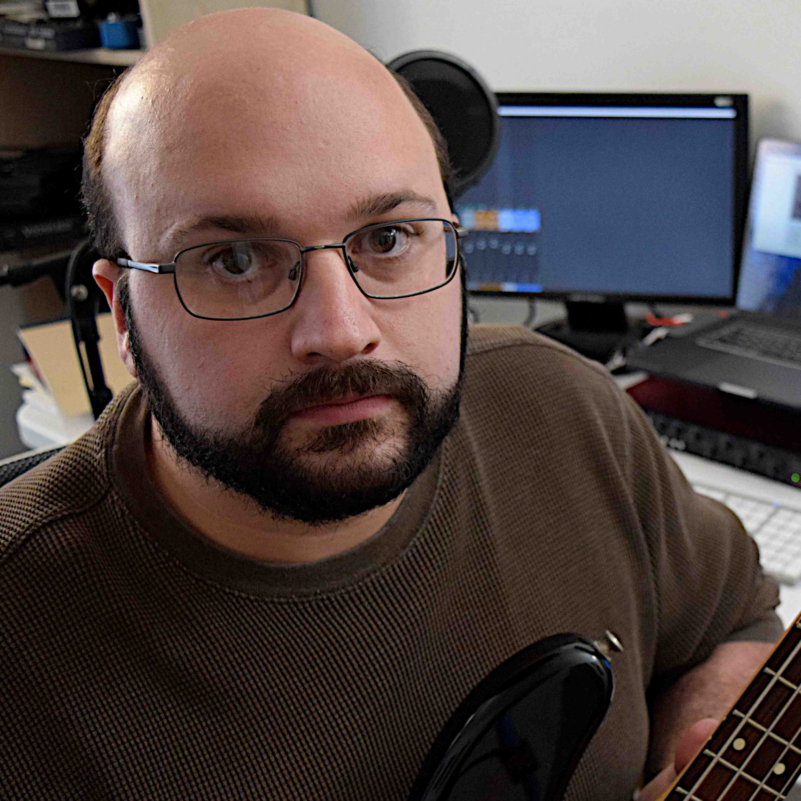
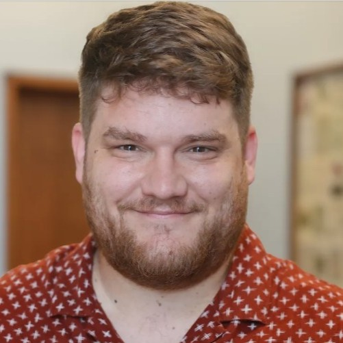
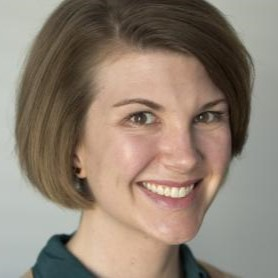
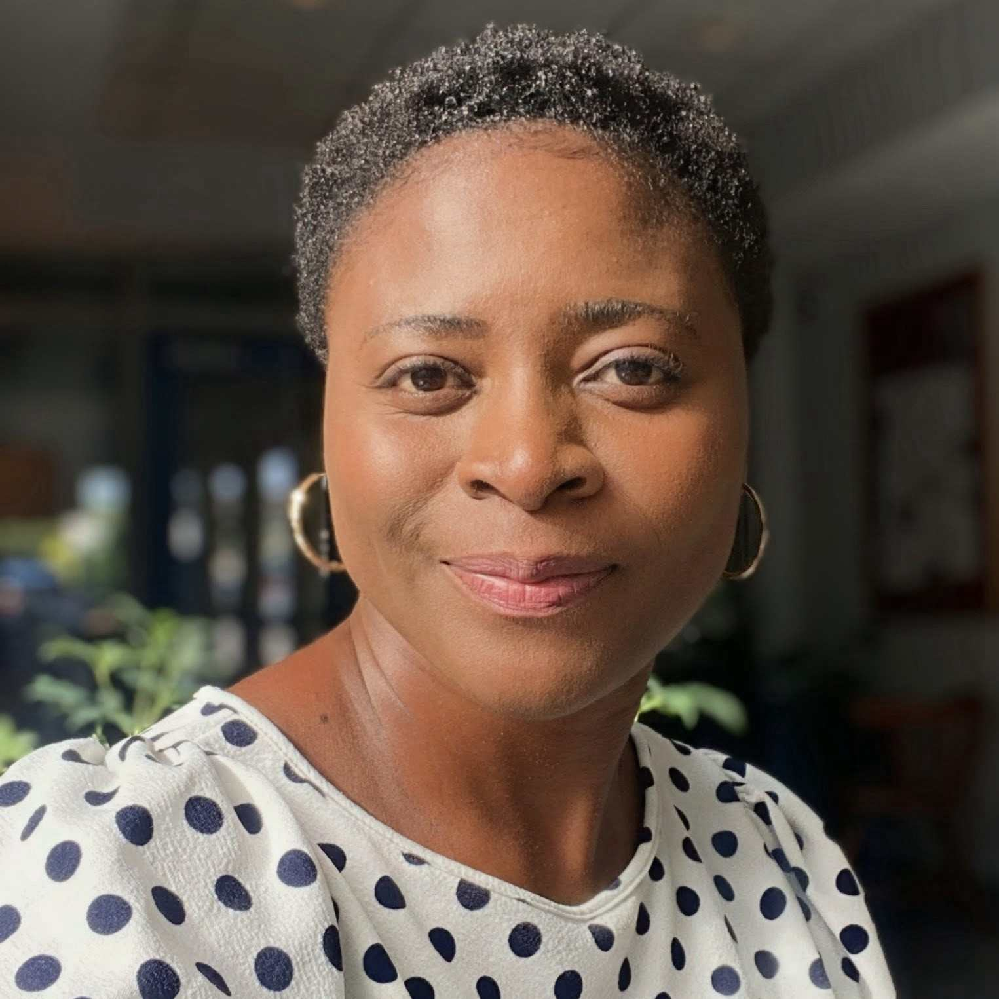
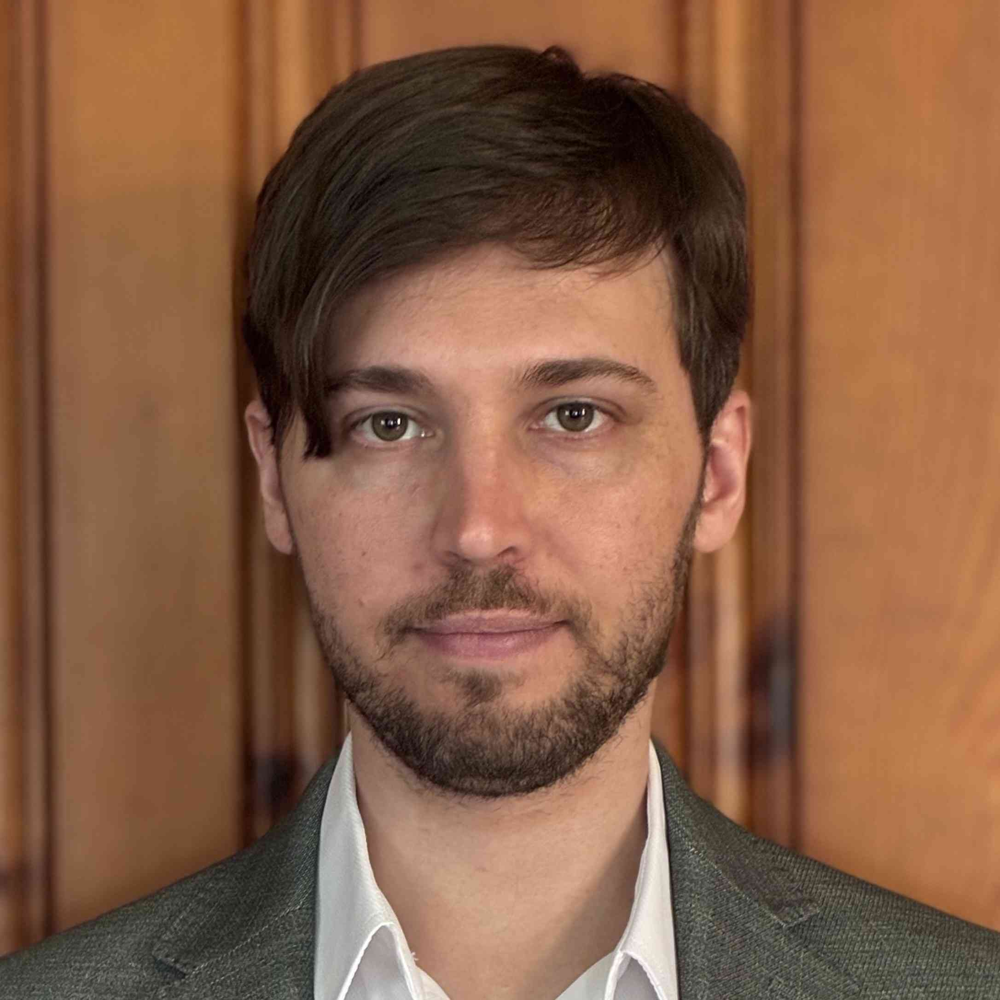
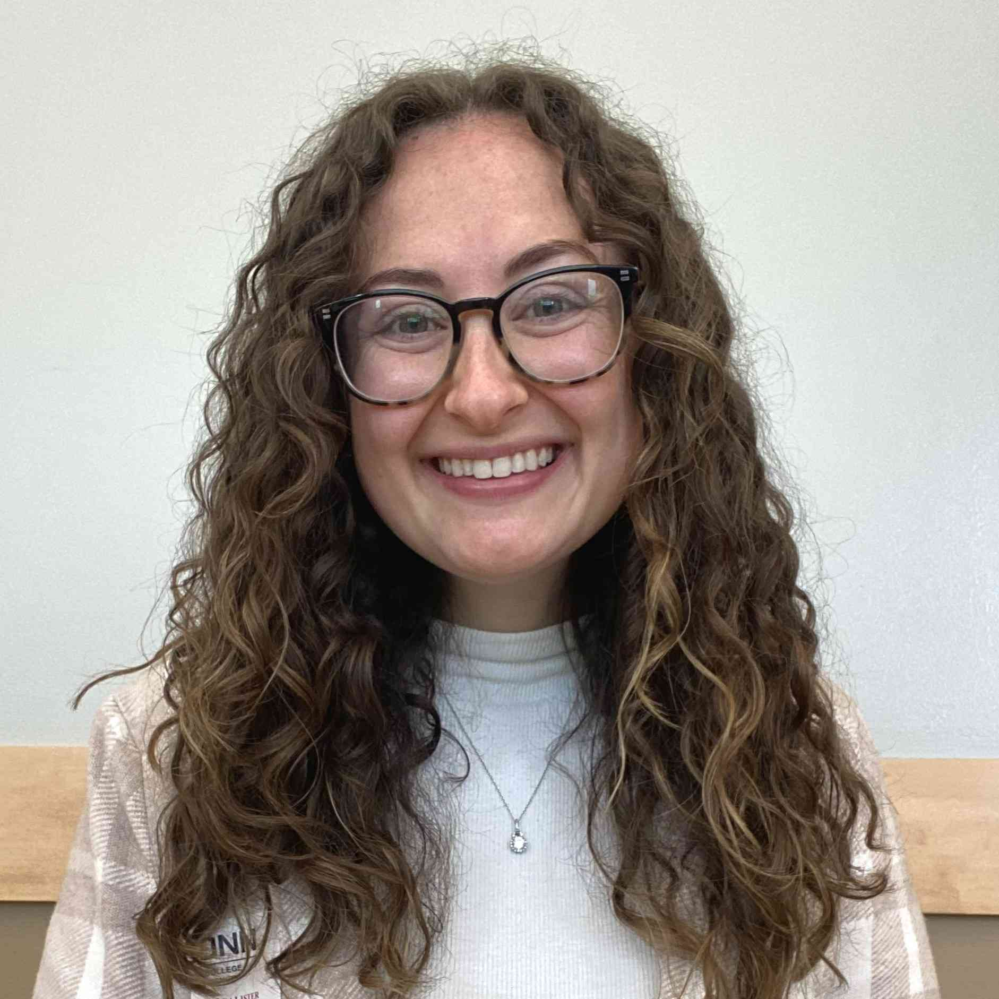
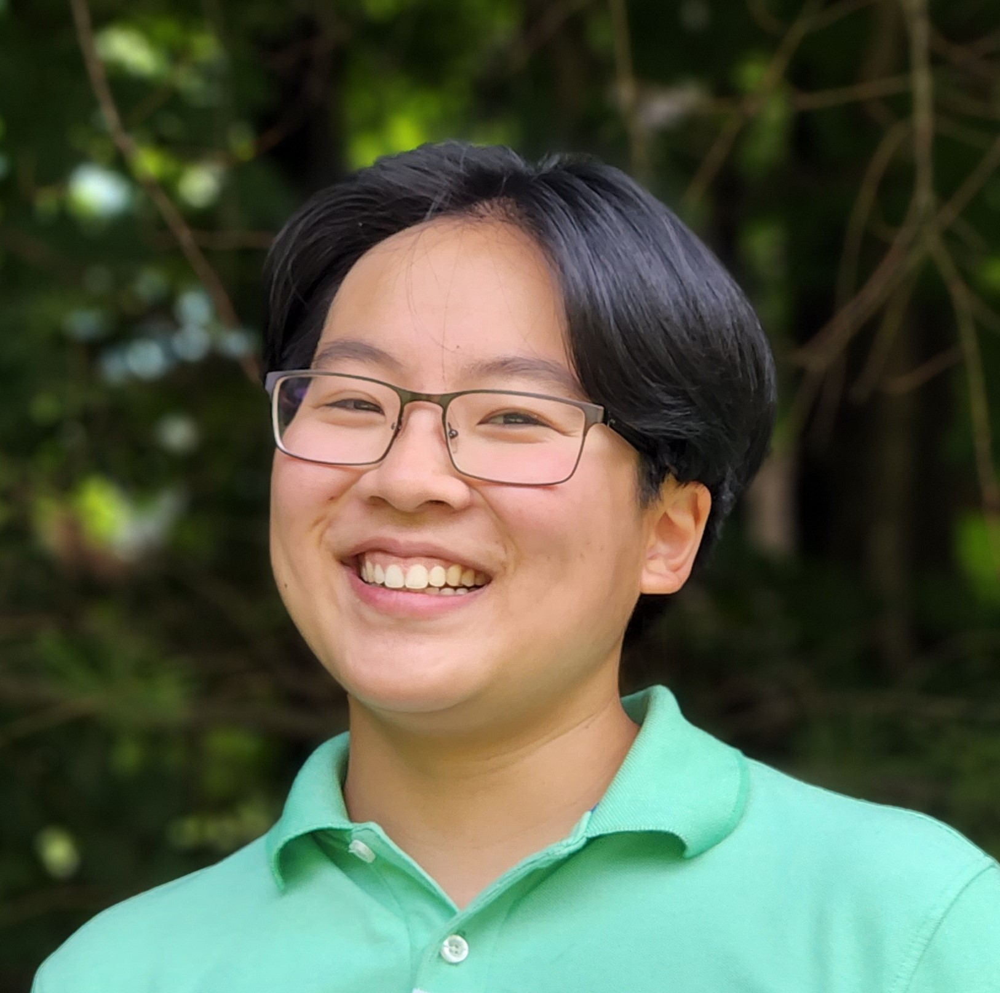

  

    <h1>About</h1>
  

### Mission Statement
_SMT-Pod_ is a creative venue for timely conversations about music, with episodes chosen through an open, collaborative peer review process. Audio-only podcasts offer a unique—though non-traditional—way of engaging with music, analysis, and contemporary issues in the field. This new publication medium affords our society both the ability to face outwards, by engaging in public scholarship, and inwards, by hosting meaningful conversations about the activity of music analysis. The variety of episode topics will reflect the diversity of the scholars and their scholarship in our field, making _SMT-Pod_ an invaluable publication for music analysts at any stage. Through its goal of promoting a sense of community and inclusivity, _SMT-Pod_ will reach beyond the boundaries of the SMT at this critical moment of calls for the revitalization of our field

>#### [Read more about our submission process](../submit)
>#### [Read more about our Open Collaborative Peer Review (OCPR)](../submit/OCPR)
>#### [Read about our ethics and standards for publication](ethics)

If you have any questions about the process, please feel free to contact the [_SMT-Pod_ Board](mailto:smt-pod@societymusictheory.org).

### Executive

Contact us at [smt-pod@societymusictheory.org](mailto:smt-pod@societymusictheory.org).

#### Editor

Matthew Ferrandino (2026–2029; Seasons 6–8) is a Lecturer of Music Theory at Eastern Illinois University. He received his Ph.D. in music theory from the University of Kansas. His research focuses on the analysis and interpretation of popular music and musical multimedia. In addition to writing about popular music, he is also an active singer/songwriter and recording artist as well as a sound designer for video games.

  

#### Associate Editors

Robert Komaniecki (2025–2028; Seasons 5–7) is a lecturer at the University of British Columbia. He received his PhD in Music Theory from Indiana University in 2019, and has previously taught at Appalachian State University and the University of Iowa. His research interests include rap music, music technology, pedagogy, public music theory, and musicals. Robert's publications can be found in journals such as <em>Music Theory Online</em>, <em>The Journal of Music Theory Pedagogy</em>, and <em>Integral</em>.

<strong>Favorite Podcasts:</strong> <a href="https://www.thisguysucked.com/" target="_blank">This Guy Sucked</a>, <a href="https://wondery.com/shows/scamfluencers/" target="_blank">Scamfluencers</a>, <a href="https://switchedonpop.com/" target="_blank">Switched on Pop</a>, <a href="https://radiolab.org/" target="_blank">RadioLab</a>.

Caitlin Martinkus (2026–2029; Seasons 6–8) teaches music theory courses at Penn State University. Her research interests include musical form in the nineteenth century, historical and contemporaneous theories of musical form, and the music of Franz Schubert. Caitlin has presented at both the national and international level and her publications have appeared in <em>Music Theory and Analysis</em>, <em>Music Theory Online</em>, <em>Theory and Practice</em>, and <em>Music Analysis</em>, with work forthcoming in <em>The Oxford Handbook of Musical Variation</em> and in an edited collection on the nineteenth-century violin concerto with Cambridge University Press. Caitlin completed her PhD in music theory at the University of Toronto; she is an affiliate of the Centre for the Study of Nineteenth-Century Music at the University of Toronto and a founding member of Open the Gates—a research collective centering issues of access and inclusion in tabletop roleplaying games.

Anna Rose Nelson (2024–2027; Seasons 4–6) is an Assistant Clinical Professor of music theory at the University of Maryland-College Park with research interests in modernist music, early hardcore punk music, sketch study, short forms, and critical theory. She holds degrees in theory and composition, including a PhD in music theory from the University of Michigan (2023). She has presented her work on Theodor Adorno, Brian Ferneyhough, and Anton Webern at multiple national and international conferences.

<strong>Favorite Podcasts:</strong> <a href="https://allthingscomedy.com/podcast/the-dollop" target="_blank">The Dollop</a>, <a href="https://www.kcrw.com/culture/shows/lost-notes" target="_blank">KCRW's Lost Notes</a>, <a href="https://myfavoritemurder.com" target="_blank">My Favorite Murder</a>.

### Editorial Board

#### Program Committee

Quintina Carter-Enyi (2026–2029; Seasons 6–8) is a doctoral student in musicology at the University of Georgia. She was a 2019 Georgia Innovation Now Fellow and is a current Southern Regional Education Board Scholar. Prior to graduate studies, she worked professionally as a singer and choral director in Lagos, Nigeria. Her work explores music, language, culture, and identity, with particular attention to Nigerian and African musical traditions within the continent and in diaspora. Her research brings together ethnomusicology, music theory, performance, and African studies, with a particular interest in Igbo and Yoruba musical practices, women composers, indigenous languages, and the intersections of African and African American music cultures. She frequently offers workshops in African instrument making, including at meetings of the African Studies Association and Society for Music Theory. Her scholarship appears in Frontiers in Psychology, Intersections, Music Theory Online, Performance Research, and Yale Journal of Music & Religion. As a fluent speaker of both Igbo and Yoruba, her scholarship and creative work foreground African-centered approaches to music research, pedagogy, and performance.

The music of composer David Dies (2026–2029; Seasons 6–8) has been praised for its subtle timbres, spare textures, and ceremonial austerity. Performed across three continents by renowned artists like James Kryshak, Mimmi Fulmer, and Marc Vallon, his work has been featured at the York Spring Festival, on Chicago’s WFMT, and on his 2013 Albany Records release, agevolmente. As a theorist, his 2013 chapter, "Defining Spiritual Minimalism," in the Ashgate Research Companion to Minimalist and Postminimalist Music, is widely cited. An Assistant Professor at the University of Wisconsin–La Crosse, Dies is currently setting the entirety of Federico García Lorca’s El Diván del Tamarit for tenor James Kryshak, with ten songs from the cycle—performed by Kryshak and pianist Joel Papinoja—having premiered at the Barcelona Festival of Song in the summer of 2025, and the complete cycle to be premiered in February 2027. This cycle will be followed by an upcoming set of three songs for mezzo-soprano Clara Osowski and string quartet on poetry by Charles Baxter.

<strong>Favorite Podcast:</strong> <a href="https://www.imaginaryworldspodcast.org/" target="_blank">Imaginary Worlds</a>

John Heilig (2024–2027; Seasons 4–6) is a PhD candidate in Music Theory at Indiana University. His research interests include twelve-tone music, electroacoustic music, musical texture, and performance and analysis. He holds an MM in Music Theory from Indiana, as well as a BM in Music Theory with a Saxophone Performance certificate from Florida State. His dissertation aims to enliven discourse on musical texture by engaging with music as experienced through performance from the intersecting perspectives of a listener, analyst, and performer. He has most recently served as an instructor of music theory at George Mason University and the University of Maryland. He loves cycling, thrifting, climbing, and living in Buffalo with his wife, small dog, and mean cat.

<strong>Favorite Podcasts:</strong> <a href="https://www.maintenancephase.com" target="_blank">Maintenance Phase</a>, <a href="https://yourewrongabout.com" target="_blank">You're Wrong About</a>, <a href="https://podcasts.apple.com/us/podcast/the-dream/id1435743296" target="_blank">The Dream</a>, <a href="https://stownpodcast.org" target="_blank">S-Town</a>, <a href="https://www.bbc.co.uk/programmes/p07nkd84" target="_blank">The Missing Cryptoqueen</a>.

Orit Hilewicz (2025–2028; Seasons 5–7) is Associate Professor of Music Theory at the Indiana University Jacobs School of Music.

Shersten Johnson (2024–2027; Seasons 4–6) is Professor of Music at the University of St. Thomas in St. Paul, where she teaches music theory and composition. Her interests include contemporary opera, disability and aging studies, and music theory pedagogy. Her publications appear in journals such as <em>Music & Letters</em> and <em>Music Theory Online</em>. She is also author of several book chapters including “Understanding is Seeing: Music Analysis and Blindness” and "Embodied Rhythm and Musical Impact of Ritualized Violence in 20th-century Opera," both in Oxford Handbooks. She is currently working on a monograph with the working title “Aging and Creativity in Britten’s ‘Death in Venice.’”

Clair Nguyen (2025–2028; Seasons 5–7) serves as Lecturer in Music Theory at UNC Greensboro. Her primary research focuses on the intersections of music theory and film & media studies that includes films, music videos, video games, theme park music, Japanese anime, and Hatsune Miku rhythm games. Her secondary research area centers on Vietnamese popular and traditional music, including the <em>vọng cổ</em> tradition. She currently serves as advisor for the UNCG Animation Club as well as co-chair for the Society of Music Theory’s Film and Multimedia interest group.

Clair also presented her research at conferences such as All Ears: Music and Sound in and Beyond Disney Theme Parks, the Ludomusicology Study Group of the American Musicological Society, Music and the Moving Image, Music Theory Midwest, the North American Conference on Video Game Music, and the Society for Music Theory. She also presented at the 2025 JAMS@AX Academic Symposium that reached Anime Expo audiences beyond the scope of traditional academia.

<strong>Favorite Podcasts:</strong> <a href="https://writingexcuses.com/" target="_blank">Writing Excuses</a>, <a href="https://www.imaginaryworldspodcast.org/" target="_blank">Imaginary Worlds</a>, <a href="https://www.darkdice.com/" target="_blank">Dark Dice</a>.

John Peterson (2026–2029; Seasons 6–8) is Associate Director for the School of Music and Professor of Music Theory at James Madison University. He studies form, musical meaning, popular music, and music theory pedagogy. His co-authored articles are published in <em>Music Theory Spectrum</em>, the <em>Journal of Music Theory Pedagogy</em>, and <em>SMT-V</em>. As part of a team of scholars, John worked to revise and expand <em><a href="https://viva.pressbooks.pub/openmusictheory/">Open Music Theory</a></em>, a free, open-access textbook for use in undergraduate music theory classes. His co-edited book, <em><a href="https://doi.org/10.1093/oso/9780197678473.001.0001">Modeling Musical Analysis</a></em>, was published by Oxford University Press in 2025.

<strong>Favorite Podcasts:</strong> <a href="https://officeladies.com/" target="_blank">Office Ladies</a>, <a href="https://wheelbearings.media/" target="_blank">Wheel Bearings</a>, <a href="https://www.neonhum.com/show-pages/dinners-on-me" target="_blank">Dinner's On Me</a>.

Stephanie Venturino (2026–2029; Seasons 6–8) is an assistant professor of music analysis and musicianship at the Yale School of Music. Her research interests include twentieth- and twenty-first-century French music, the history of music theory, and music theory and aural skills pedagogy. Her work appears or is forthcoming in <em>Music Theory Online</em>, <em>Music Theory and Analysis</em>, and <em>Theoria: Historical Aspects of Music Theory</em>, as well as in edited collections from Cambridge University Press, Routledge, and University of Rochester Press. She is also a co-editor of and contributor to <em>Chromatic Harmony: Methodological Approaches in Dialogue</em> (Routledge, 2027), a collection of analytical essays centered on the vocal music of Alma Mahler-Werfel. She currently serves as reviews editor for <em>Theory and Practice</em> and chair of the SMT Student Presentation Award Committee.

Alice (Bai) Xue (2026–2029; Seasons 6–8) is an Assistant Professor of Music Theory at the Peabody Institute of The Johns Hopkins University. Her current research focuses on form and structure in oral music traditions, with particular emphasis on African music. She received her Ph.D. in Music Theory from the CUNY Graduate Center.

    

#### Production Committee

Chair: Zachary Lloyd (2023–2026; Seasons 3–5) is a Ph.D. Candidate in Music Theory at Florida State University. He holds a Masters degree in Music Theory from Michigan State University and a Bachelors in Music from Appalachian State University. As a music theorist, Zachary is interested in the ways that meaning is expressed through music. His research has explored various musical styles ranging from 20th century piano repertoire by Florence Price to musical theater scores as recent as 2022.

José Garza (2023–2027; Seasons 3–6) is an Associate Professor of Instruction in Music Theory and Aural Skills at Texas State University. He received his Bachelor’s degree in Music Studies and Master’s degree in Music Theory from Texas State University, then attended Florida State University, where he received his Ph.D. in Music Theory. His scholarship deals primarily with rhythm, meter, and musical meaning in popular music, particularly metal and punk rock. His other research interests include video game music, percussion repertoire, and twentieth- and twenty-first-century art music repertoire.

Jason Jedlička (2024–2027; Seasons 4–6) is an Assistant Professor of Music Theory at Belmont University.

Mark Micchelli is a Visiting Assistant Professor of Composition at West Virginia University. His research interests include improvisation, performance analysis, tonal gravity, and creative practice as a mode of music-theoretical inquiry. As a composer, he writes music that hybridizes contemporary classical, jazz, and popular music idioms, often incorporating electronics and multimedia elements. He has published work in <em>Music Theory Online</em> and <em>SMT-Pod</em>, and his debut album <em>Glitched-On Bop</em> was released on New Focus Records in 2025. More at <a href="markmicchelli.net">markmicchelli.net</a>.

Alex Sallade is on the faculty of The Ohio State University.

#### Composition Chair

Frank Nawrot (2024–2027; Seasons 4–6) is a composer, guitarist, and scholar. His original music is inspired by Danny Brown, Julia Wolfe, Meshuggah, Julius Eastman, and Prince. Frank's music has been performed around the world—in Chicago, New York City, Kansas City, Hong Kong, Croatia, and Canada. He has earned a reputation for writing music that is accessible, while being challenging enough to provide audiences with a fresh and exciting experience. Frank is regularly commissioned to compose music for saxophone, voice, piano, concert band, and more. He also records and produces music in a variety of styles. Armed with a doctoral degree in music composition and fifteen years performing rock, pop, and hip hop, Frank brings a unique sound to the stage, the radio, and the screen. Two of Frank’s recent major creative projects include the recording of his first opera, <em>Don Henry</em>, about a Kansas student who fought and died in the Spanish Civil War, and his electronic-rock album, <em>Nostalgia Trap</em>—both are available on Spotify and Apple Music. Frank is also sound designer and composer for the short story podcast, Tiny Tales.

Frank’s research interests include popular music, minimalism, and composition pedagogy. He has presented his research for the Society of Music Theory, the Society of Minimalist Music, and the Society of Composers, Inc., among others. Frank is Assistant Professor of Music Theory and Music Technology at Southeast Missouri State University.

<strong>Favorite Podcasts:</strong> <a href="https://www.tinytalespodcast.com/" target="_blank">Tiny Tales</a>, <a href="https://www.gideon-media.com/steal-the-stars" target="_blank">Steal the Stars</a>, <a href="https://twoupproductions.com/limetown/podcast" target="_blank">Limetown</a>, <a href="https://crooked.com/podcast-series/this-land/" target="_blank">This Land</a>, <a href="https://parallaxviews.podbean.com/" target="_blank">Parallax Views</a>

#### Accessibility Chair

Shannon McAlister (2022–2026; Seasons 2–5) is a PhD candidate in music theory and history and a graduate teaching assistant at the University of Connecticut. She earned her MA in music theory and graduate certificates in disability studies in public health and in college instruction from the University of Connecticut. She completed her BM in music education with a minor in disability studies from the University of Delaware. Shannon’s research interests include pedagogy, disability studies, and the intersection of music and public health messaging.

#### Website Committee

Sylvie Tran (2024–2027; Seasons 4–6) is an Assistant Professor of Music Theory at Michigan State University. Her current research examines portrayals of the American West through lenses of race, gender, and landscape and the environment, primarily in American classical music from the twentieth and twenty-first centuries. Her secondary research, drawing from her experience as a flutist, deals with performance and analysis, particularly the intersubjective aspects of chamber music performance as well as the politics of reorchestration and arrangements/transcriptions. Sylvie holds a PhD in music theory from the University of Michigan and a bachelor’s degree in flute performance from the University of California, Santa Barbara.

### Past Editorial Board Members

#### Editors

Founding Co-Editor: Jennifer Beavers (2021–2024; Seasons 1–3)  
Founding Co-Editor: Megan Lyons (2021–2026; Seasons 1–5)

#### Associate Editors

Matthew Ferrandino (2024–2026; Seasons 4–5)

#### Program Committee

Leah Frederick (2024–2026; Seasons 4–5)  
Caitlin Martinkus (2024–2026; Seasons 4–5)
Joseph Straus (2024–2026; Seasons 4–5)  
Evan Ware (2024–2026; Seasons 4–5)  
Jennifer Weaver (2021–2026; Seasons 1–5)

#### Production Committee

Lydia Bangura (2021–2023; Seasons 1–3)  
Richard Desinord (2021–2023; Seasons 1–3)  
Anna Rose Nelson (2021–2023; Seasons 1–3)  
David Thurmaier (2021–2023; Seasons 1–3)  
Katrina Roush (2021–2025; Seasons 1–4)  
Amy Hatch (2024–2025; Season 4)

#### Composition Committee

Thomas Yee (2021–2025; Seasons 1–4)

#### Website Committee

Stefanie Acevedo (2021–2026; Seasons 1–5)  
William O'Hara (2021–2023; Seasons 1–3)

<h4><a href="#top">Back to Top</a></h4>
